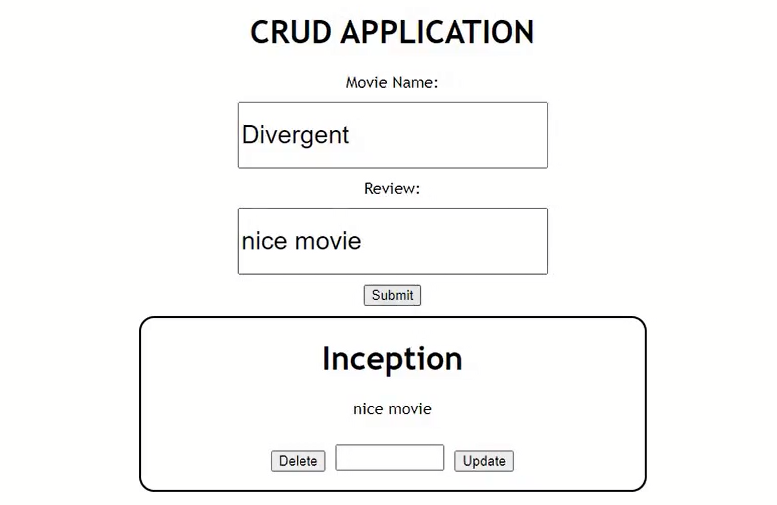

<h1 align="center">Nodejs-MovieListAppUsingMySql</h1>
<a href="#">
  

    
  

</a>

## What I have learnt:
- [x] MySQL Database.
- [x] Express Framework.
- [x] BodyParser.
- [x] Cors

## What This App does:
- [x] Developed this app using Express Framework.
- [x] Worked on Get, Insert, Update and Delete functions.
- [x] Designed Front-End using HTML, CSS and React.
- [x] Used MySQL Database for this app.

## Author
You can get in touch with me on my LinkedIn Profile:

#### Hira Shahid

You can also follow my GitHub Profile to stay updated about my latest projects: 

If you liked the repo then kindly support it by giving it a star ⭐!

## LICENSE
- MIT (2021)
